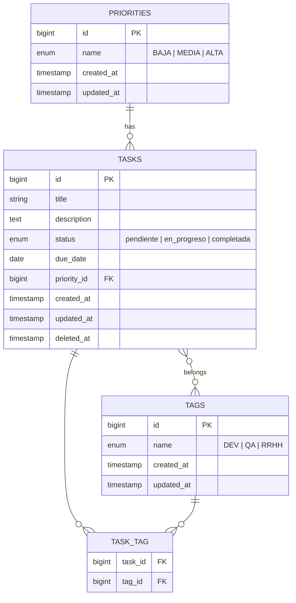

# Task Manager

Fullstack task management application with complete CRUD, priorities, and tags.

## Tech Stack

| Layer | Technology |
|-------|-----------|
| Backend | [Laravel 12](https://laravel.com/) · [PHP 8.4](https://www.php.net/) · [Pest](https://pestphp.com/) |
| Frontend | [Vue 3](https://vuejs.org/) · [Pinia](https://pinia.vuejs.org/) · [Vue Router](https://router.vuejs.org/) · [TypeScript](https://www.typescriptlang.org/) |
| Database | [MySQL 8.0](https://www.mysql.com/) |
| Containers | [Docker Compose](https://docs.docker.com/compose/) |

## Prerequisites

- Docker and Docker Compose

## Getting Started

```bash
# 1. Clone the repository
git clone <repo-url> && cd task-manager

# 2. Set up environment variables
cp .env.example .env

# 3. Start the containers
docker-compose up -d

# 4. Run migrations and seeders
docker exec task_manager_api php artisan migrate --seed
```

The application will be available at:

| Service | URL |
|---------|-----|
| Frontend | http://localhost:5173 |
| Backend API | http://localhost:8000 |
| MySQL | localhost:3306 |

## Data Model




## Useful Commands

```bash
# Start environment
docker-compose up -d

# Stop environment
docker-compose down

# Run migrations
docker exec task_manager_api php artisan migrate

# Reset database with seeders
docker exec task_manager_api php artisan migrate:fresh --seed

# Run tests
docker exec task_manager_api php artisan test

# Lint PHP (Pint)
docker exec task_manager_api vendor/bin/pint
```
